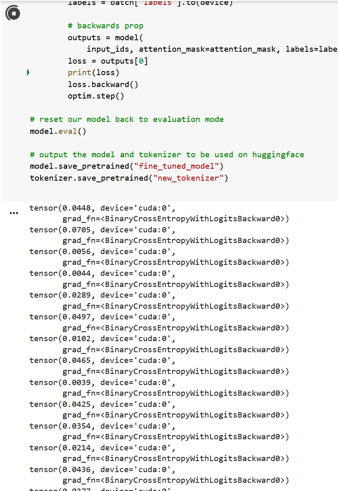

### [link to hugging face model](https://huggingface.co/spaces/davidchiii/toxic-tweets)

# Toxic Media - language-models

A introduction to natural language processing and sentimental analysis through the scope of analyzing negative online behaviors.

# Requirements

## WSL 2

For Windows users, first install WSL2. Install link [here](https://learn.microsoft.com/en-us/windows/wsl/install)

### Powershell

> `wsl --install`

Containers are lightweight, abstractions at the application layer that packages code and depencies together. Sharing the same operating system kernel, containers take up less space and run as isolated namespaces.

## Docker

This project uses [Docker](https://docs.docker.com/engine/install).

[Docker Desktop](https://docs.docker.com/desktop/install/windows-install/) is an alternative for Windows users that provides a GUI alternative to the WSL subsystem. Understand the [tradeoffs](https://www.docker.com/blog/guest-blog-deciding-between-docker-desktop-and-a-diy-solution/) for using Docker Desktop.

### Update repository

```
sudo apt-get update
sudo apt-get upgrade
```

### Install Docker packages

```
sudo apt install docker-ce docker-ce-cli containerd.io
```

### Install VSCode

Located [here](https://code.visualstudio.com/download).

Install DevContainers Extension.
Through this extension, you can now open any directory in a development container through the bottom left icon.

### Accessing the container

In Docker Desktop, you can find the container ID under the `Containers` tab.

In WSL2, execute
```
docker ps
```
to show all running containers on the system.

Copy the ID and run the command
```
docker exec -it [container-id] /bin/sh
```
to start a shell in container.


---

## Writeup

The model was trained on the Toxic Comment Classification Dataset found [here](https://www.kaggle.com/competitions/jigsaw-toxic-comment-classification-challenge/data).

The challenge aims to classify toxicity into the following categories:

- toxic
- severe_toxic
- obscene
- threat
- insult
- identity_hate

The model was trained using Google Colab and exported to HuggingFace Models. The base model, "distilbert-base-uncased", served as the original model in which the dataset helped fine tune.

The output of the model is a set of values corresponding to how much of each category the input tweet is.

[Google site](https://sites.google.com/nyu.edu/toxic-tweets/home)

### Loss

I calculated loss using binary-cross entropy. For every batch, we can call the model to measure its loss.
It hovers around 0.03 to 0.06, dropping sometimes to 0.01.


